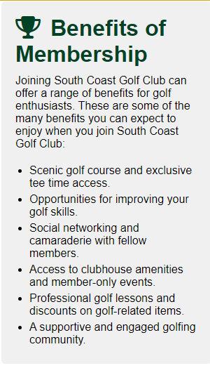
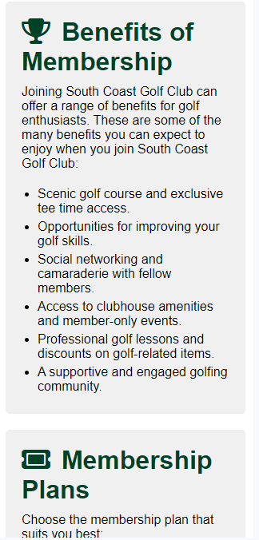

# [South Coast Golf Club](https://professorjames.github.io/south-coast-golf-club/ "South Coast Golf Club")

# Goal for this Project

Welcome to South Coast Golf Club! Our website is your gateway to the world of golf. We aim to engage and attract potential members and visitors by providing essential information and details on how to join our vibrant golfing community.

At South Coast Golf Club, golf isn't just a sport; it's a lifestyle. 
Join us, play, and embrace the beauty of the game. Explore our website, and let's embark on a memorable golfing journey together!

# Table of Contents

- [South Coast Golf Club](#south-coast-golf-club)
- [Goal for this Project](#goal-for-this-project)
- [Table of Contents](#table-of-contents)
- [UX](#ux)
  - [User Goals](#user-goals)
  - [User Stories](#user-stories)
  - [Site Owner Goals](#site-owner-goals)
    - [Requirements](#requirements)
    - [Expectations](#expectations)
  - [Design Choices](#design-choices)
    - [Fonts](#fonts)
  - [Colours](#colours)
    - [Icons](#icons)
    - [Structure](#structure)
- [Features](#features)
  - [Navigation Bar](#navigation-bar)
  - [Landing Page](#landing-page)
    - [Course Section](#course-section)
    - [Membership Section](#membership-section)
    - [Gallery Section](#gallery-section)
    - [Contact Section](#contact-section)
    - [Footer Section](#footer-section)
  - [Features to be Implemented](#features-to-be-implemented)
- [Technologies used](#technologies-used)
  - [Languages](#languages)
  - [Libraries and Frameworks](#libraries-and-frameworks)
  - [Tools](#tools)
- [Testing](#testing)
  - [Bugs](#bugs)
  - [Unfixed-Bugs](#unfixed-bugs)
- [Deployment](#deployment)
- [Credits](#credits)
    
# UX

## User Goals
* Engaging Visuals: Incorporate high-quality images and graphics that showcase the beauty of the golf course, facilities, and the sport itself. Visual elements should captivate visitors and create a sense of excitement.

* Intuitive Navigation: Design the website for easy navigation, ensuring that visitors can quickly find the information they seek. A well-organized menu and user-friendly layout enhance the browsing experience.

* Contact Information: Ensure that contact details for the golf club are prominently displayed on the website. This includes the club's physical address, phone number, and email address.

* Contact Form: Implement a user-friendly contact form that allows visitors to reach out to the club directly. The form should be easy to locate and use, enhancing communication between the club and potential members or visitors.

## User Stories

* As a user, I want the website to be user-friendly and easily navigable. 
* As a user, I want the website to have a clear menu and layout.
* As a user, I want to efficiently find the information I need about membership and pricing.
* As a user, I want to find information that confirms the golf course's reputation and history, so I can trust it as a well-established venue for golfing.
* As a user, I want the website to provide comprehensive details about membership options and benefits, to help me consider joining.
* As a user, I want to easily access the club's contact information, phone number, and email, so I can quickly get in touch if I have questions, or inquire about membership.
* As a user, I want the option to contact the golf club through various methods, such as social media platforms and a dedicated inquiry form.
* As a user, I want to know the location of the golf course, including a map, so I can easily find my way to the club.

## Site Owner Goals

* Promote the Club: The primary goal of the website is to effectively promote the golf club, showcasing its unique features, facilities, and the exceptional golfing experience it offers. The website should highlight the club's history, its commitment to excellence, and the outstanding amenities it provides to members and visitors.

* Increase Membership: The website should serve as a valuable tool for increasing the number of club members. It should provide clear information about the benefits of club membership. The goal is to attract and convert website visitors into new members.

* Improve Search Engine Rankings: To increase the online visibility of the golf club, a goal is to improve search engine rankings. This involves optimizing the website for relevant keywords, creating high-quality content, and implementing SEO best practices to ensure the website ranks higher in search engine results pages (SERPs).
 
### Requirements

1. The website is designed to be responsive, ensuring a seamless and user-friendly experience on various screen sizes and devices, including desktops, tablets, and mobile phones.
2. Provide comprehensive and well-structured information about the golf club.
3. Implement simple and readily accessible methods for users to contact the club.
4. Have an intuitive and user-friendly navigation system with a well-organized menu structure that makes it easy for visitors to find the information they need quickly and efficiently.
5. Include a dedicated section that provides detailed information about club membership options making it easy for potential members to understand and join.
6. Integrate social media buttons and links throughout the website to encourage users to follow the club on social platforms and stay updated on news and events.

### Expectations

1. Form Submission Confirmation: I expect to receive clear confirmation when I submit a form successfully. If I leave any required fields unfilled, I expect to be prompted with specific error messages indicating what needs to be corrected.
2. Social Media Links Behavior: I expect that when I click on social media links, these links will open in new browser tabs or windows, allowing me to easily return to the website without losing my place.
3. Navigation Functionality: I expect all navigation links to work correctly and efficiently. When I click on menu items or links, I expect them to lead to the intended pages or sections without errors or broken links.
4. Responsive Design: I expect that the website's layout and content quality remain consistent regardless of the screen size or device I am using. The website should adapt seamlessly to various screen sizes, ensuring a positive user experience for me.
5. Accurate Information: I expect the website to provide accurate and up-to-date information about the golf club and membership details. Any discrepancies or outdated information can lead to frustration and a loss of trust.

\
&nbsp;
[Back to top](#table-of-contents)
\
&nbsp;

## Design Choices

### Fonts
To enhance typography, [Google Fonts](https://fonts.google.com/ "Google Fonts") were employed. 
[Montserrat](https://fonts.google.com/specimen/Montserrat?query=montserrat "Montserrat") was selected for text in the Course section and for the Logo. 
The rest of the website was styled with [Roboto](https://fonts.google.com/specimen/Roboto?query=roboto "Roboto") to create a distinct separation from the text in the course section and Logo.

## Colours

I have selected the colours for the website manually. I had a picture in my mind what the website would look like before starting coding. These colours seem like a good fit for a Golf Course in Ireland, with a use of green and golds throughout the website. For text and styling I have used a number of grays to provide subtle contrast where needed.

| CSS Variable Name | Hex Code | Comment |
|---|---|---|
| green | `#004225` | Used as a background colour for header, nav, contact and location sections. Also used as a text colour for some section headings. |
| gold | `#DAA520` | Used to colour the double border in nav and header section. Also used to style labels in contact form, and to add hover effects for social media icons. |
| yellow | `#E8AB16` | Used to style contact text in Contact & Location sections. |
| #ffd700 | `metallic-gold` | Used to style hover effect on form submit button. |
| black | `#000` | Used as background colour for footer section. Also used to style award paragraph in Course section. |
| dark-gray | `#666` | Used to style paragraph text in Course section. |
| gray | `#ccc` | Used to style borders for Gallery images and form-input fields. |
| silver | `#c0c0c0` | Used to style borders for div in Membership section. |
| light-gray | `#f0f0f0` | Used as a background colour in Membership Benefits and Membership Plans sections. |
| white | `#FFFFFF` | Used as background colour throughout site and to style text across website. |

Note:  The colour pallette image was generated using [Coolors](https://coolors.co/ "Coolors"). There is a discrepancy between the color variable names I have used in the CSS variable names and the names that Coolors has given the colours. The reason for this is because the Colour pallette from Coolors was generated after the CSS and CSS variable names had been written for the website.

### Icons
In our project, we've enriched the user interface by incorporating icons sourced from [Font Awesome](https://fontawesome.com/ "Font Awesome"), a widely-used icon library. These icons provide visual cues and enhance the overall user experience. They are carefully chosen and thoughtfully placed to improve the clarity and aesthetics of the website.

### Structure

This project follows a mobile-first design approach, with a focus on ensuring that the website looks and functions well on smaller screens. The primary reference point for styling is the Galaxy Fold, with a screen width of 280px. 

To create a responsive design that adapts to various screen sizes, we use breakpoints inspired by Bootstrap. These breakpoints help us optimize the layout and styling of our website for different devices and screen widths.
You can find more information about Bootstrap breakpoints in their official documentation [Bootstrap breakpoints](https://getbootstrap.com/docs/5.0/layout/breakpoints/ "Bootstrap").

| Screen Size | Breakpoint |
| ----------- | ---------- |
| x-small     | <576px     |
| small       | => 576px   |
| medium      | => 768px   |
| large       | => 992px   |
| x-large     | => 1200px  |

\
&nbsp;
[Back to top](#table-of-contents)
\
&nbsp;

# Features

## Navigation Bar
The responsive navigation bar is designed to accommodate various screen sizes and offers easy navigation through the site, including a clickable club logo for returning to the home section.

+ Tablet (>=768px)

The navigation bar spans the entire width of the device and displays all links (Home, Course, Membership, Gallery & Contact Us) for clear user access.

To enhance user experience, the colour of the text for each section changes when users hover over each link.

+ Smaller Devices (<768px)

To ensure usability on smaller devices, the navigation bar adopts a hamburger-style design.

When the hamburger icon is clicked, it expands to reveal the main menu with all available links.

To enhance user experience, the colour of the text for each section changes when users hover over each link.

## Landing Page

The hero image provides users with an immediate and captivating view of the picturesque golf course, highlighting its scenic location along the coast. This visually engaging element is designed to capture users' attention and create an appealing first impression. 

\
&nbsp;
[Back to top](#table-of-contents)
\
&nbsp;

### Course Section

The core objective of the website's "Course" section is to efficiently promote the golf club, spotlighting its distinctive attributes, history, and the extraordinary golfing opportunities it provides. This section is dedicated to spotlighting the club's storied history, unwavering dedication to excellence, and the exceptional amenities that members enjoy. The Course section isresponsive and adjusts to suit different screen sizes.

*Desktop*

*Tablet*
  

*Mobile*

### Membership Section

The Membership section is designed to provide a clear understanding of what individuals can gain by becoming a club member. It aims to highlight the advantages and privileges offered, fostering an appreciation for the value of club affiliation.

These membership options cater to various age groups and circumstances, allowing individuals to choose the membersip options that best suits their individual circumstances
 
*Desktop*

*Tablet*
  

*Mobile*

### Gallery Section

The Gallery section includes photos of South Coast Golf Club. The gallery section highlights the beauty of the course, the practice facilities and also shows other members enjoying the Clubs great facilities. 
 
*Desktop*

*Tablet*
  

*Mobile*

\
&nbsp;
[Back to top](#table-of-contents)
\
&nbsp;

### Contact Section

The Contact section offers a convenient way for users to send messages directly to the South Coast Golf Club. Additionally, it provides a map displaying the club's location. 
 
*Desktop*

*Tablet*
  

*Mobile*

* The provided form fields are all mandatory and will prevent submission until they are properly filled out. This includes email validation to ensure it conforms to a valid format. 
  
*Name validation*

*Email validation*

*Message validation*

  
* Furthermore, a hover effect has been implemented on the submit button to provide users with visual feedback indicating its active status.
  

* Upon submitting the form, users will be directed to a confirmation page indicating that their details have been successfully received.

* Users will be automatically redirected back to South Coast Golf Club home page after 10 seconds. This gives users sufficient time to read the message displayed on the page.
* There is also a home icon that users can click on to bring them back to the South Coast Golf Club home page as well. A hover effect has been implemented on the home icon to provide users with visual feedback indicating its active status.

\
&nbsp;
[Back to top](#table-of-contents)
\
&nbsp;

### Footer Section

* In the Footer section, you will discover South Coast Golf Club's social media links, as well as the club's telephone number and email address. To facilitate user convenience and enable seamless navigation back to South Coast Golf Club's website, all social media links open in new tabs upon clicking.

* The Footer section also incorporatee a subtle hover effect over the links. 

* Clicking the phone number icon asks the user if they want to initiate a call via the user's computer application, while clicking the email icon will launch the user's computer email application for easy correspondence.

## Features to be Implemented
1. Online Tee Time Booking: Allow users to book tee times online, making it convenient for golfers to plan their rounds.
2. Course Tour: Provide a virtual tour of the golf course with hole-by-hole descriptions, images, and videos to help golfers familiarize themselves with the layout.
3. Pro Shop: Enable online shopping for golf equipment, club merchandise, and apparel.
4. Lesson Booking: Allow users to schedule golf lessons with club instructors.
5. Weather Updates: Display real-time weather information for the golf course location.
6. Newsletter Signup: Allow visitors to subscribe to newsletters for updates and promotions.

# Technologies used

## Languages

  * [HTML](https://developer.mozilla.org/en-US/docs/Web/HTML "HTML")
- [CSS](https://developer.mozilla.org/en-US/docs/Web/CSS "CSS")
  
## Libraries and Frameworks
  * [Google Fonts](https://fonts.google.com/ "Google Fonts")
  * [Font Awesome](https://fontawesome.com/search "Font Awesome")

## Tools
  * [Code Anywhere](https://codeanywhere.com/ "Code Anywhere")
  * [W3C HTML Validation Service](https://validator.w3.org/ "W3C HTML")
  * [W3C CSS Validation Service](https://jigsaw.w3.org/css-validator/ "W3C CSS")
  * [Coolors](https://coolors.co/ "Coolors")
  * [AmIResponsive](https://ui.dev/amiresponsive/ "AmIResponsive")

\
&nbsp;
[Back to top](#table-of-contents)
\
&nbsp;

# Testing

Testing was essential to ensure the website functions correctly and meets the desired user experience. The following testing was conducted throughout the development of the website:

1. Navigation
* Homepage: Verified that the homepage loads without errors, and all navigation links, such as the header menu and footer links, work as expected.

* Thank-you page: Verified that the thank-you page loads without errors when a user submits a form. Tested that thank-you page redirects automatically back to the home page after 10 seconds. Also tested that if users click on home icon they will be brought to home page.

* Internal Links: Tested navigation to internal sections (Logo, Home, Course, Membership, Gallery & Contact Us) to confirm they load correctly and the navigation is consistent throughout the site.

2. Forms and User Input
* Contact Form: Tested the contact form, ensuring users can submit inquiries or messages successfully. Validated that form fields have proper validation and error handling.

* User Inputs: Tested all input fields in Contact Form with valid and invalid inputs to ensure proper validation and error messages.

3. Content and Functionality
* Text Content: Reviewed all text content for accuracy, grammar, and spelling.

* Images and Iframe: Ensured that images and iframe load correctly and display as intended.

4. Responsive Design
* Mobile Devices: Tested the website on various mobile devices (e.g., galaxy fold, smartphones and tablets) to ensure that it is responsive and adapts well to different screen sizes.
* Logo: The text for the Logo section was initially causing problems with the display of the hero image when changing between larger device sizes. After consideration, it was decided to shorten the Logo text from "South Coast Golf Club" to "SCGC" to address this issue.  

* Desktop: Tested the website on large screen sizes to ensure that it is responsive and adapts well to different screen sizes.

* Browser Compatibility: Verified that the website functions correctly on different web browsers (Chrome, Edge & Firefox) to ensure cross-browser compatibility.

5. Cross-Device Testing
* Tested the website on various devices and screen sizes to ensure a consistent and user-friendly experience across platforms.

6. Validation

* Each line of code been meticulously reviewed. Changes were made where necessary, and we're thrilled to report that our work has received unanimous approval from the W3C validators.
  
  (i) HTML (index.html) validator results

    

  (ii) CSS (style.css) validator results
  
    

7. Performance & Accessibility Best Practices

    By adhering to accessibility best practices, we can ensure that our website provides an excellent user experience to a wide range of users.

     

    We note that there is room for improvement on the performance score (72). An area for focus in the future will be to improve times for:
      (i) First Contentful Paint, 
      (ii) Largest Contentful Paint, 
      (iii) Total Blocking Time, and
      (iv) Speed Index 

    This will be done as our development skills and knowledge increase. 

8. Linter Settings
    
    The default linter setting on CodeAnywhere were changing the layout for HTML code. Added .prettierrc file and updated settings in IDE to ehance formatting of HTML document in line with industry best practice - HTML code is now layed out like a 'Christmas Tree'.
    

## Bugs

   1.  Web Accessibility testing - When running the website through [Wave](https://wave.webaim.org/report#/https://professorjames.github.io/south-coast-golf-club/ "WAVE") it was showing an error. The error relates to "Empty form label, A form label is present, but does not contain any content". To address this issue I added an aria-hidden="true" to the HTML. Content hidden with aria-hidden="true" is not presented to screen reader users.
   
   2.  Media Queries - The media queries were providing some trouble with placmenet of the Hero image. This was due to a missing closing tag for one of the media queries. This caused much time spent looking to fix an issue that ultimately due to poor css or poor html. Lesson learned is to check both HTML & CSS code with validators earlier. Also learned to use IDE to format document on save so that any silly missing bracklet issues don't reoccur.
   
   3.  CSS - Refactor code tp target specific elements instead of combining element selectors. This allows targeting to be more specific, and helps code to be more reusable.
   
   4.  Number of Font-Weights:  Importing a lot of font-weights was significantly increasing the amount of CSS that would need to be loaded, which would have an impact on website performance. This was addressed by reducing the number of font-weights imported.

   5. Consistency in measurements - Reviewed and rewrote code to ensure that sizes were consistent throughout and were all using rems instead of pixels or percentages. Pixels are used for measurments less than 0.5rem.i.e. 1px, 2px, 3ps or 4px. The rem scale was reset for easier calculation with 1rem = 10px. 
   
   6. Security - Initially when a user submitted the contact form they were sent to the FormDump. This is a page showing the information the user has submitted. As an alternative we made a new Thank-you page that displays when a user submits their contact information, so this is no longer an issue.
 
   7. Time to automatically redirect from Thank-you page home page: Initially the time was set to 5 seconds. However after testing, it was felt that 5 seconds would not be enough time for users to read all of the text and choose to take an action. To avoid user frustration the automatic refresh period was increased to 10 seconds from 5 seconds.
   
## Unfixed-Bugs

    If I had a bit more time before suproject submission I would carry out the following fixes and updates:

   1. Linter setting in IDE - Fix settings on linter so that it stops adding in "Trailing slash on void elements". I had fixed this issue previously. Unfortunately, when ajusting other settings subsequently another setting has been changed causing the error to reoccur.
   2. CSS Colour variable names: Update CSS color variable names to match the names in the Coolors pallette. This woudl be done for consistency in naming and to avoid any potential confusion for future users of the code or developers.  
   3. Website performance: An area for focus in the future will be to make adjustments or refactor code to improve performance times in ine with industry best practice for:
      (i) First Contentful Paint, 
      (ii) Largest Contentful Paint, 
      (iii) Total Blocking Time, and
      (iv) Speed Index 
     
\
&nbsp;
[Back to top](#table-of-contents)
\
&nbsp;

# Deployment

After writing and committing the code to GitHub, the project was deployed using the following GitHub deployment steps:

+ Go to the GitHub repository and click on the 'Settings' tab.
+ In the side navigation menu, choose 'Pages.'
+ Under the 'Source' section, click on the dropdown menu labeled 'None' and select 'main'
+ Click the 'Save' button to confirm your selection.
+ The website is now live at https://professorjames.github.io/south-coast-golf-club/.

\
&nbsp;
[Back to Top](#table-of-contents)
\
&nbsp;
# Credits

For guidance, advice, motivation, and inspiration:

[Simen Daehlin](https://github.com/Eventyret "Simen Daehlin") has been incredibly supportive, helping me learn and develop while also presenting me with challenging opportunities. I'm grateful for his guidance, and I look forward to continuing to learn under his mentorship. Thanks Simen.
 
Inpired by:

Code Institute's Love running

\
&nbsp;
[Back to Top](#table-of-contents)
\
&nbsp;