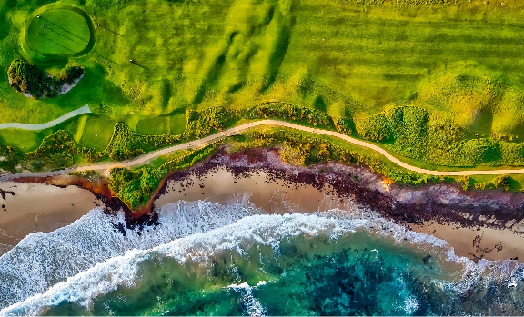
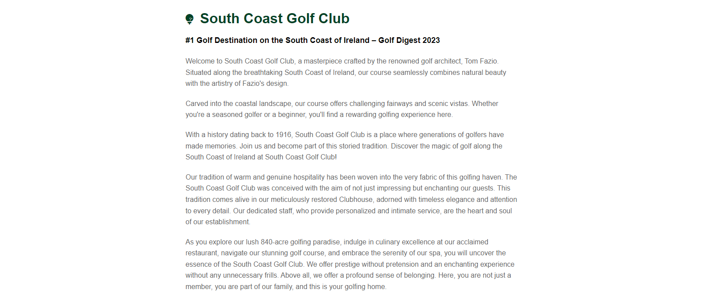

# [South Coast Golf Club](https://professorjames.github.io/south-coast-golf-club/ "South Coast Golf Club")

# Goal for this Project

Welcome to South Coast Golf Club! Our website is your gateway to the world of golf. We aim to engage and attract potential members and visitors by providing essential information and details on how to join our vibrant golfing community.

Our website goals include:

1. Club Introduction: Discover South Coast Golf Club's history, facilities, and the welcoming community of golfers that call it home.

2. Join Our Community: Learn about the membership options available and how to become a part of our golfing family. Whether you're a seasoned pro or new to the game, we have membership opportunities to suit your needs.

3. Connect with Us: Easily reach out to us via social media platforms or our contact form. We're here to answer your questions, extend a warm welcome to golfers of all levels, and keep you updated on club news and events.

At South Coast Golf Club, golf isn't just a sport; it's a lifestyle. Join us, play, and embrace the beauty of the game. Explore our website, and let's embark on a memorable golfing journey together!

# Table of Contents

- [South Coast Golf Club](#south-coast-golf-club)
- [Goal for this Project](#goal-for-this-project)
- [Table of Contents](#table-of-contents)
- [UX](#ux)
  - [User Goals](#user-goals)
  - [User Stories](#user-stories)
  - [Site Owner Goals](#site-owner-goals)
    - [Requirements](#requirements)
    - [Expectations](#expectations)
  - [Design Choices](#design-choices)
    - [Fonts](#fonts)
  - [Colours](#colours)
    - [Icons](#icons)
    - [Structure](#structure)
- [Features](#features)
  - [Navigation Bar](#navigation-bar)
  - [Landing Page](#landing-page)
    - [Course Section](#course-section)
    - [Gallery Section](#gallery-section)
    - [Contact](#contact)
    - [Footer](#footer)
  - [Features to be Implemented](#features-to-be-implemented)
- [Technologies used](#technologies-used)
  - [Languages](#languages)
  - [Libraries and Frameworks](#libraries-and-frameworks)
  - [Tools](#tools)
- [Testing](#testing)
  - [Manual Testing](#manual-testing)
    
# UX

## User Goals
* Engaging Visuals: Incorporate high-quality images and graphics that showcase the beauty of the golf course, facilities, and the sport itself. Visual elements should captivate visitors and create a sense of excitement.

* Intuitive Navigation: Design the website for easy navigation, ensuring that visitors can quickly find the information they seek. A well-organized menu and user-friendly layout enhance the browsing experience.

* Contact Information: Ensure that contact details for the golf club are prominently displayed on the website. This includes the club's physical address, phone number, and email address.

* Contact Form: Implement a user-friendly contact form that allows visitors to reach out to the club directly. The form should be easy to locate and use, enhancing communication between the club and potential members or visitors.

## User Stories

* As a user, I want the website to be user-friendly and easily navigable. 
* As a user, I want the website to have a clear menu and layout.
* As a user, I want to efficiently find the information I need about membership and pricing.
* As a user, I want to find information that confirms the golf course's reputation and history, so I can trust it as a well-established venue for golfing.
* As a user, I want the website to provide comprehensive details about membership options and benefits, to help me consider joining.
* As a user, I want to easily access the club's contact information, phone number, and email, so I can quickly get in touch if I have questions, or inquire about membership.
* As a user, I want the option to contact the golf club through various methods, such as social media platforms and a dedicated inquiry form.
* As a user, I want to know the location of the golf course, including a map, so I can easily find my way to the club.

## Site Owner Goals

* Promote the Club: The primary goal of the website is to effectively promote the golf club, showcasing its unique features, facilities, and the exceptional golfing experience it offers. The website should highlight the club's history, its commitment to excellence, and the outstanding amenities it provides to members and visitors.

* Increase Membership: The website should serve as a valuable tool for increasing the number of club members. It should provide clear information about the benefits of club membership. The goal is to attract and convert website visitors into new members.

* Improve Search Engine Rankings: To increase the online visibility of the golf club, a goal is to improve search engine rankings. This involves optimizing the website for relevant keywords, creating high-quality content, and implementing SEO best practices to ensure the website ranks higher in search engine results pages (SERPs).
 
### Requirements

1. The website is designed to be responsive, ensuring a seamless and user-friendly experience on various screen sizes and devices, including desktops, tablets, and mobile phones.
2. Provide comprehensive and well-structured information about the golf club.
3. Implement simple and readily accessible methods for users to contact the club.
4. Have an intuitive and user-friendly navigation system with a well-organized menu structure that makes it easy for visitors to find the information they need quickly and efficiently.
5. Include a dedicated section that provides detailed information about club membership options making it easy for potential members to understand and join.
6. Integrate social media buttons and links throughout the website to encourage users to follow the club on social platforms and stay updated on news and events.

### Expectations

1. Form Submission Confirmation: I expect to receive clear confirmation when I submit a form successfully. If I leave any required fields unfilled, I expect to be prompted with specific error messages indicating what needs to be corrected.
2. Social Media Links Behavior: I expect that when I click on social media links, these links will open in new browser tabs or windows, allowing me to easily return to the website without losing my place.
3. Navigation Functionality: I expect all navigation links to work correctly and efficiently. When I click on menu items or links, I expect them to lead to the intended pages or sections without errors or broken links.
4. Responsive Design: I expect that the website's layout and content quality remain consistent regardless of the screen size or device I am using. The website should adapt seamlessly to various screen sizes, ensuring a positive user experience for me.
5. Accurate Information: I expect the website to provide accurate and up-to-date information about the golf club and membership details. Any discrepancies or outdated information can lead to frustration and a loss of trust.

\
&nbsp;
[Back to top](#table-of-contents)
\
&nbsp;

## Design Choices

### Fonts
To enhance typography, [Google Fonts](https://fonts.google.com/ "Google Fonts") were employed. 
[Montserrat](https://fonts.google.com/specimen/Montserrat?query=montserrat "Montserrat") was selected for text in the Course section and for the Logo. 
The rest of the website was styled with [Roboto](https://fonts.google.com/specimen/Roboto?query=roboto "Roboto") to create a distinct separation from the text in the course section and Logo.

## Colours

I have selected the colours for the website manually. I had a picture in my mind what the website would look like before starting coding. These colours seem like a good fit for a Golf Course in Ireland, with a use of green and golds throughout the website. For text and styling I have used a number of grays to provide subtle contrast where needed.

 * #004225 - Variable name = green - Used as a background colour for header, nav, contact and location sections. Also used to as a text colour for some section headings.
 * #DAA520 - Variable name = gold - Used to colour the double border in nav and header section. Also used to style award paragraph in Course section, labels in contact form, and to add hover effects for social media icons.  
 * #E8AB16 - Variable name = yellow: Used to style contact text in Contact & Location sections.
 * #ffd700 - Variable name = metallic-gold: Used to style hover effect on form submit button.
 * #000 - Variable name = black: Used as background colour for footer section.
 * #000 - Used as background colour throughout site and to style text across website.
 * #666 - Variable name = dark-gray: Used to style paragraph text in Course section.
 * #ccc - Variable name = gray: Used to style borders for Gallery images and form-input fields.
 * #c0c0c0 - Variable name = silver: Used to style borders for div in Membership section.
 * #f0f0f0 - Variable name = light-gray: Used as a background colour in Membership Benefits and Membership Plans sections.
 * #000 - Used as background colour throughout site and to style text across website.

Note:  The colour pallette image was generated using [Coolors](https://coolors.co/ "Coolors"). There is a discrepancy between the color variable names I have used in the CSS code and the names that Coolors has given. This is because the Colour pallette from Coolors was generated after the code for the website had been written.

### Icons
In our project, we've enriched the user interface by incorporating icons sourced from [Font Awesome](https://fontawesome.com/ "Font Awesome"), a widely-used icon library. These icons provide visual cues and enhance the overall user experience. They are carefully chosen and thoughtfully placed to improve the clarity and aesthetics of the website.

### Structure

This project follows a mobile-first design approach, with a focus on ensuring that the website looks and functions well on smaller screens. The primary reference point for styling is the Galaxy Fold, with a screen width of 280px. 

To create a responsive design that adapts to various screen sizes, we use breakpoints inspired by Bootstrap. These breakpoints help us optimize the layout and styling of our website for different devices and screen widths.
You can find more information about Bootstrap breakpoints in their official documentation [Bootstrap breakpoints](https://getbootstrap.com/docs/5.0/layout/breakpoints/ "Bootstrap").

| Screen Size | Breakpoint |
| ----------- | ---------- |
| x-small     | <576px     |
| small       | => 576px   |
| medium      | => 768px   |
| large       | => 992px   |
| x-large     | => 1200px  |

\
&nbsp;
[Back to top](#table-of-contents)
\
&nbsp;

# Features

## Navigation Bar
The responsive navigation bar is designed to accommodate various screen sizes and offers easy navigation through the site, including a clickable club logo for returning to the home section.

+ Tablet (>=768px)

The navigation bar spans the entire width of the device and displays all links (Home, Course, Membership, Gallery & Contact Us) for clear user access.

To enhance user experience, the colour of the text for each section changes when users hover over each link.

+ Smaller Devices (<768px)

To ensure usability on smaller devices, the navigation bar adopts a hamburger-style design.

When the hamburger icon is clicked, it expands to reveal the main menu with all available links.

To enhance user experience, the colour of the text for each section changes when users hover over each link.

## Landing Page

The hero image provides users with an immediate and captivating view of the picturesque golf course, highlighting its scenic location along the coast. This visually engaging element is designed to capture users' attention and create an appealing first impression. 

\
&nbsp;
[Back to top](#table-of-contents)
\
&nbsp;

### Course Section

The core objective of the website's "Course" section is to efficiently promote the golf club, spotlighting its distinctive attributes, history, and the extraordinary golfing opportunities it provides. This section is dedicated to spotlighting the club's storied history, unwavering dedication to excellence, and the exceptional amenities that members enjoy. The Course section isresponsive and adjusts to suit different screen sizes.

*Desktop*

*Tablet*
  

*Mobile*

### Gallery Section

### Contact 

### Footer

## Features to be Implemented
1. Online Tee Time Booking: Allow users to book tee times online, making it convenient for golfers to plan their rounds.
2. Course Tour: Provide a virtual tour of the golf course with hole-by-hole descriptions, images, and videos to help golfers familiarize themselves with the layout.
3. Pro Shop: Enable online shopping for golf equipment, club merchandise, and apparel.
4. Lesson Booking: Allow users to schedule golf lessons with club instructors.
5. Weather Updates: Display real-time weather information for the golf course location.
6. Newsletter Signup: Allow visitors to subscribe to newsletters for updates and promotions.

# Technologies used

## Languages

  * [HTML](https://developer.mozilla.org/en-US/docs/Web/HTML "HTML")
- [CSS](https://developer.mozilla.org/en-US/docs/Web/CSS "CSS")
  
## Libraries and Frameworks
  * [Google Fonts](https://fonts.google.com/ "Google Fonts")
  * [Font Awesome](https://fontawesome.com/search "Font Awesome")
  * [CDNJS](https://cdnjs.com/libraries/font-awesome "CDNJS for Font Awesome")

## Tools
  * [Code Anywhere](https://codeanywhere.com/ "Code Anywhere")
  * [W3C HTML Validation Service](https://validator.w3.org/ "W3C HTML")
  * [W3C CSS Validation Service](https://jigsaw.w3.org/css-validator/ "W3C CSS")
  * [Coolors](https://coolors.co/ "Coolors")
  * [AmIResponsive](https://ui.dev/amiresponsive/ "AmIResponsive")

\
&nbsp;
[Back to top](#table-of-contents)
\
&nbsp;

# Testing

## Manual Testing
Manual testing was essential to ensure the website functions correctly and meets the desired user experience. The following manual testing was conducted throughout the development of the website:

1. Navigation
* Homepage: Verified that the homepage loads without errors, and all navigation links, such as the header menu and footer links, work as expected.

* Internal Links: Tested navigation to internal sections (Logo, Home, Course, Membership, Gallery & Contact Us) to confirm they load correctly and the navigation is consistent throughout the site.

3. Forms and User Input
* Contact Form: Tested the contact form, ensuring users can submit inquiries or messages successfully. Validated that form fields have proper validation and error handling.

* User Inputs: Tested all input fields in Contact Form with valid and invalid inputs to ensure proper validation and error messages.

4. Content and Functionality
* Text Content: Reviewed all text content for accuracy, grammar, and spelling.

* Images and Iframe: Ensured that images and iframe load correctly and display as intended.

5. Responsive Design
* Mobile Devices: Tested the website on various mobile devices (e.g., galaxy fold, smartphones and tablets) to ensure that it is responsive and adapts well to different screen sizes.

* Desktop: Tested the website on large screen sizes to ensure that it is responsive and adapts well to different screen sizes.

* Browser Compatibility: Verified that the website functions correctly on different web browsers (Chrome, Edge & Firefox) to ensure cross-browser compatibility.

6. Cross-Device Testing
* Tested the website on various devices and screen sizes to ensure a consistent and user-friendly experience across platforms.

7. Validation

* Each line of code been meticulously reviewed. Changes were made where necessary, and we're thrilled to report that our work has received unanimous approval from the W3C validators.
  
  (i) HTML (index.html) validator results

    

  (ii) CSS (style.css) validator results
  
    

8. Performance & Accessibility Best Practices

    By adhering to accessibility best practices, we can ensure that our website provides an excellent user experience to a wide range of users.

     

    We note that there is room for improvement on the performance score (72). An area for focus in the future will be to improve times for:
      (i) First Contentful Paint, 
      (ii) Largest Contentful Paint, 
      (iii) Total Blocking Time, and
      (iv) Speed Index 

    This will be done as our development skills and knowledge increase. 

\
&nbsp;
[Back to top](#table-of-contents)
\
&nbsp;